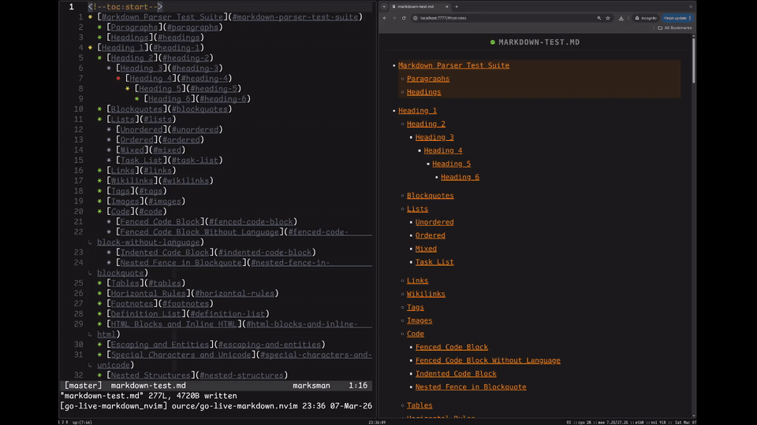
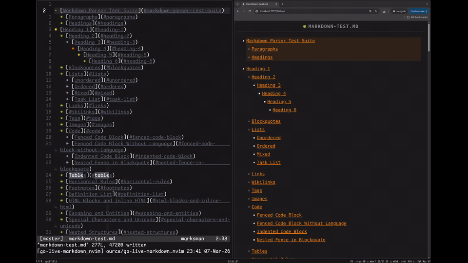
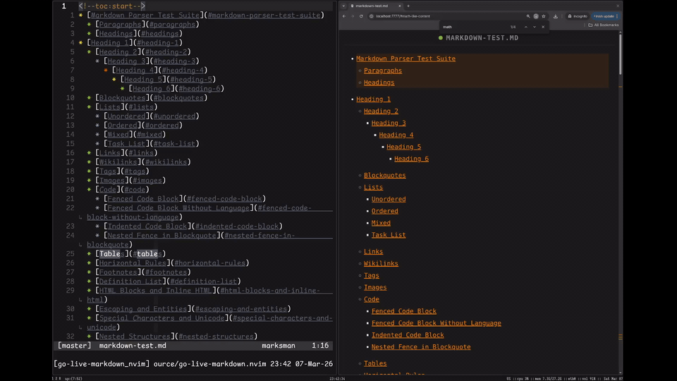
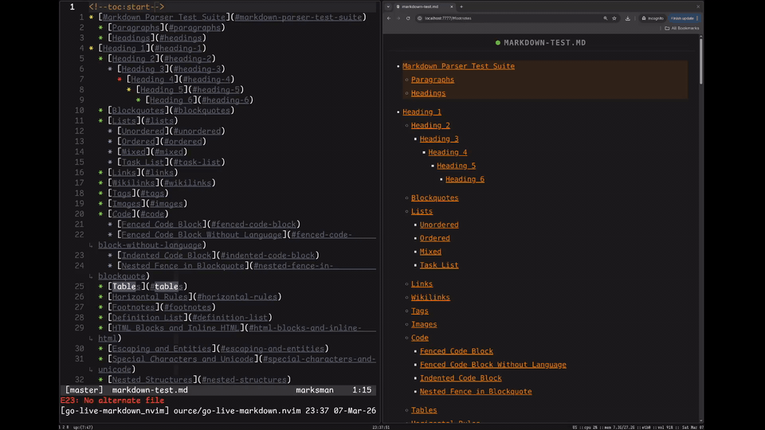

# go-live-markdown.nvim

Highly opinionated live Markdown preview for Neovim, powered by a Go remote host and a local WebSocket preview server.

## Demos

### Basic live preview



### Browser to Neovim sync (double click)



### Copy rendered code blocks



### Live update on buffer change



## Why this plugin

`go-live-markdown.nvim` focuses on a tight markdown editing loop:

- Start preview once with `:GoLiveMarkdownStart`
- Type in Neovim and see rendered output update immediately
- Move cursor in Neovim and let browser auto-follow the active source line
- Double-click in browser to jump Neovim cursor back to that markdown line
- Copy code block contents directly from preview

No Node runtime or external web app is required.

## Requirements

- Neovim with remote plugin support (the plugin uses a Go host)
- A browser
- Go toolchain **only if you need to build the host binary**

## Installation

### `lazy.nvim`

```lua
{
  "pompos02/go-live-markdown.nvim",
  ft = "markdown",
}
```

### `lazy.nvim` (recommended for non-Linux systems)

This repo includes a Linux host binary at `bin/go-live-markdown-nvim`.
On macOS (and other non-Linux systems), build from source on install:

```lua
{
  "pompos02/go-live-markdown.nvim",
  ft = "markdown",
  build = "./build",
}
```

## Host binary resolution

At startup, the plugin resolves the host executable in this order:

1. `vim.g.go_live_markdown_host_prog`
2. Local plugin binary: `./bin/go-live-markdown-nvim`
3. `go-live-markdown-nvim` from `$PATH`

If the host is not found, you'll see an error in Neovim and preview will not start.

### Optional override

```lua
vim.g.go_live_markdown_host_prog = "/absolute/path/to/go-live-markdown-nvim"
```

## Usage

1. Open any `*.md` buffer.
2. Run:

   ```vim
   :GoLiveMarkdownStart
   ```

3. Neovim echoes the preview URL (served locally on `http://127.0.0.1:7777`).
4. Just use Nvim and the preview will follow you around

### Browser interactions

- **Double click** a rendered block to jump Neovim to that source line.
- **Single click heading text** to navigate by heading anchors.
- **Click the heading anchor** on `h1`-`h3` to collapse or expand that section.
- **Click code-language badge** (top-right of fenced blocks) to copy code to clipboard.

## Markdown and rendering features

The renderer uses Goldmark with extensions and custom AST decoration.

Included support:

- GFM (tables, strikethrough, task lists, autolinks)
- Footnotes
- MathJax math rendering (inline and block)
- Wiki links
- Alert/callout blocks
- Syntax highlighting (Chroma classes)
- Heading anchors
- Source-line metadata on rendered block elements for sync

### Local image handling

Local image paths are served by the local preview server.

- Relative paths resolve from the markdown file's directory
- Absolute local paths are supported
- Remote URLs should work

## Build from source

Build script:

```bash
./build
```

This compiles:

- from: `./cmd/go-live-markdown-nvim`
- to: `./bin/go-live-markdown-nvim`

Requirements:

- `go` available in `$PATH`

## Quick validation

Use `markdown-test.md` to validate common behavior quickly:

1. Open `markdown-test.md` in Neovim
2. Run `:GoLiveMarkdownStart`
3. Edit text and move cursor to verify live rendering + follow
4. Double click in preview to verify browser -> Neovim jump
5. Try fenced code copy badge and local image paths


## Current limitations

- Single preview server instance (fixed address `127.0.0.1:7777`)
- Single active browser connection is handled reliably (the connection will jump between the tabs)

> [!NOTE]
> - The frontend logic was written with Codex
